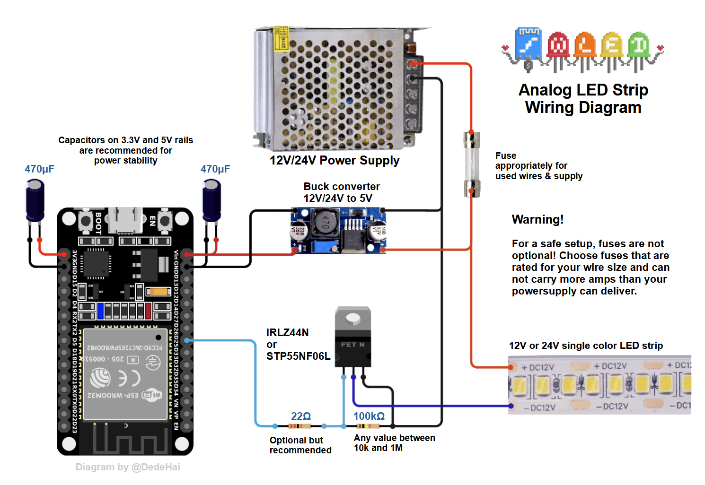

## Welcome to the WLED wiki!

!!! info "Version Info"
    Unless noted otherwise, all information applies to the latest release.

!!! warning "ESP8266 End of Life"

    Do not install any new setups using ESP8266. While WLED currently still supports ESP8266, all new setups should be using the ESP32 as it's much better hardware and ESP8266 is coming to and end of support.

### Quick start guide

**1.** Connect a WS2812B-compatible RGB(W) led strip to you ESP board:

- For ESP32 use `GPIO16` (or `IO16` or `G16`); GPIOs `4`, `13` and `16-33` can be used, other pins are not recommended.
- For ESP8266 use `GPIO2`, on most development boards this pin is labeled `D4`.

_If the connecting wire cannot be kept short, use a [level shifter/translator](/basics/compatible-hardware#levelshifters)._ Optionally, connect a normally open pushbutton to `GPIO0` (NodeMCU/Wemos pin `D3`, on ESP32 use `IO17`) and ground for [configurable actions](/features/macros).

**Caution:** Board pin naming varies depending on the manufacturer. Please use the board pinout from the _specific_ board you purchased and use the GPIO pins to reference this guide. _Make sure to connect ESP and LED-strip grounds together!_

Check out the [Wiring Guides](/basics/wiring-guides) for more examples.

While using an ESP8266 and LEDs that have clock and data, you can either use hardware SPI (mostly faster) or software SPI.

  - hardware SPI: use `GPIO14` (SCLK) for clock and `GPIO13` (MOSI) for data.
  - software SPI: since all pins can be changed in the Hardware section of LED settings, you can use any pins. Recommend is to use `GPIO1` (TxD) for clock and `GPIO2` (D4) for data. 

For safe operation, it is recommended to size your power wires correctly and to integrate fuses.  
For reference, you may use this [LED power, wiring and fuse calculator](https://wled-calculator.github.io/).

For analog LEDs, the MOSFETs IRLZ44N or STP55NF06L are good candidates. Example circuit:

More analog wiring examples can be found [here](/basics/compatible-led-strips/#non-addressable-led-strips)

**2.** Flash the software to your ESP module! There are two options for this step:

[I just want to use WLED! (install release binary)](/basics/install-binary)

[I want to modify WLED (compile from source code)](/advanced/compiling-wled)

If everything worked the first thirty LEDs will light up in bright orange to stimulate courage, friendliness and success!

**3.** Use a WiFi device to connect to the access point `WLED-AP` using the default password `wled1234`.
You can also just scan this QR code:

!!! tip "WLED-AP is not showing up!"
    If you do not see the `WLED-AP` SSID, the default SSID may have been changed at [compile time](/advanced/custom-ap).

Go to the IP `4.3.2.1` in your browser to control your lights! You should also be able to connect to `wled.me` if in access point mode (embedded DNS server).

### Wifi Setup

To connect your WLED module to your home Wifi:

**1.** Click on the _Config_ (gear) icon to edit your WLED module settings and choose "Wifi Setup".

**2.** For most home networks, simply enter your Wifi network's name and network password. You can also change the mDNS address for your WLED module here.

**3.** Click Save & Connect at the bottom of the page.

**4.** Reconnect your device to your home's Wifi network.

**5.**  Check the device list in your router's user interface for the IP of the WLED device within your local network. For easy automatic discovery, use the WLED Native app! Have fun with the WLED software!

### Default GPIO Usage

!!! info "These are only defaults"
    All pins can be changed in the Hardware section of LED settings. Please note that these are GPIO numbers, please consult a pinout for your board to find the labeled pin (e.g `D4` = `GPIO2` on most ESP8266 boards). When using an ESP8266 board, it's recommended to use pins `GPIO1`, `GPIO2`, or `GPIO3` for LED Data; using other pins will require _bit-banging_ and may cause slow performance and/or issues elsewhere (such as with IR decoding).

| Function | GPIO | Suggested pin |
|---|---|---|
LED Data | 2 | ESP8266: 1, 2 (3 if <= 100 LEDs), ESP32: 1, 2, 3, 4, 16
Button | 0 | 
IR Remote| None | 4
Relay | None | 12

### Software update procedure

Method 1: Reflashing the new update like a new install (see above).

Method 2: The software has an integrated _OTA software update_ capability.
First you have to enable it by typing in the correct OTA passphrase (default: "wledota") in the settings menu.
Remove the tick in the checkbox "OTA locked". Then save settings and reboot the ESP.
Then you can select "Manual OTA update" in Security settings and upload a [release binary](https://github.com/Aircoookie/WLED/releases).
After you are done, it is recommended to lock the OTA function again.
To do so, tick the checkbox again (you can change the passphrase by typing in a new one now). Reboot.
If you try to access the update page now, you should see the message "OTA lock active".

Method 3: ArduinoOTA is also supported.

!!! info "If you own multiple devices and want to update them"
    Since v0.13 of WLED source code includes shell/command prompt scripts which is allow you to update multiple devices with a single command. Please check `tools` subfolder for `multi-update` scripts (.cmd or .sh). You will need to modify them to include IP addresses of your WLED devices and assign firmware binary file for each device. If you are using Windows, make sure you install `curl` utility somewhere in your `PATH` (curl is included with Windows 10 since build 17063). This will only work if "OTA Lock" is disabled.
